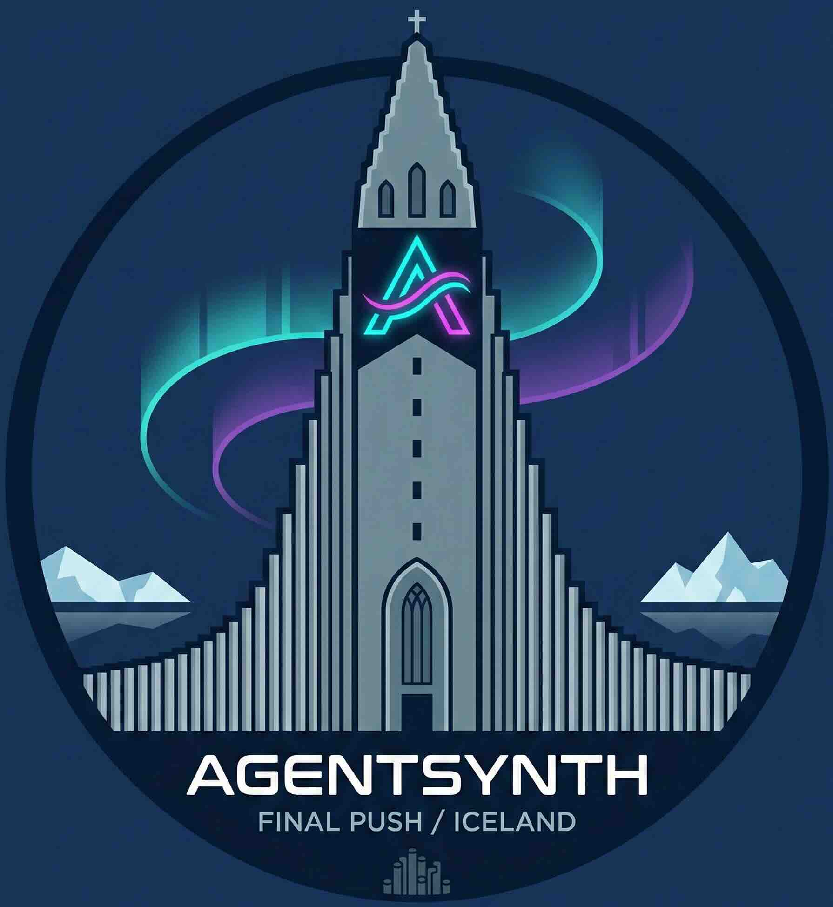

# AgentSynth

<p align="center">
  
</p>

<p align="center">
  <em>Synthetic agent training data from scratch — forward synthesis & back-translation</em>
</p>

<p align="center">
  <a href="https://github.com/alphadl/AgentSynth/actions/workflows/ci.yml">
    
  </a>
  <a href="https://pypi.org/project/agentsynth/">
    
  </a>
  <a href="https://pypi.org/project/agentsynth/">
    
  </a>
  
  <a href="https://github.com/astral-sh/ruff">
    
  </a>
  <a href="LICENSE">
    
  </a>
</p>

<p align="center">
  <a href="#installation">Installation</a> •
  <a href="#usage">Usage</a> •
  <a href="#related-projects">Related projects</a> •
  <a href="#citation">Citation</a>
</p>

---

A pipeline for synthesizing high-quality agent training data from scratch. It targets **cold start** and **data scarcity** in tool-using agent scenarios: instead of mining value from existing logs, AgentSynth generates SFT-style trajectories (user intent → reasoning + tool calls) and validates them with execution-based reject sampling.

## Design principles

- **Synthetic over manual** — Strong LLMs (e.g. GPT-4, Qwen, Claude) can produce more consistent chain-of-thought and tool-calling behavior than typical human annotators.
- **Execution as ground truth** — Any trajectory that fails to run correctly (syntax errors, hallucinated tools or arguments) is rejected before it enters the dataset.
- **Bidirectional generation** — Data is produced in two ways: **forward** (multi-teacher: scenario → full trajectory) and **back-translation** (valid tool chain → reverse-engineered user query).

## Pipeline overview

- **Pipe A — Forward synthesis**  
  Seed scenario → multiple teacher models → consensus or selection → best trajectory.

- **Pipe B — Back-translation**  
  Tool definitions → valid tool-call sequences → simulated execution → LLM generates the user query that would justify that sequence.

- **Pipe C — Reject sampling**  
  Replay each candidate trajectory in a sandbox; reject on syntax errors, unknown tools/arguments, or empty observation loops.

## Installation

```bash
cd AgentSynth
pip install -e .
```

Requires **Python 3.10+**. See `pyproject.toml` and `requirements.txt` for dependencies.

## Usage

```bash
agentsynth --help
agentsynth run -t examples/tools.json -o out.jsonl --mode back -n 2
```

**Back-translation** (tool chain → user prompt): provide a JSON file of tool definitions; the pipeline builds valid chains, back-translates each to a user query, validates, and writes accepted samples to JSONL.

**Forward** (scenario → trajectory): use `--mode forward` and `--scenarios <file>` (JSON array or one scenario per line).

## Project layout

```
AgentSynth/
├── src/agentsynth/
│   ├── core/           # Types and config (Pydantic models)
│   ├── teachers/       # Forward teachers and back-translator
│   ├── execution/      # Sandbox and trajectory validation
│   └── generators/     # Tool-chain builder
├── examples/           # Example tools.json for runnable demo
├── tests/
├── pyproject.toml
└── README.md
```

## Dependencies

- **pydantic** (≥2) — schema and validation  
- **litellm** — LLM calls (OpenAI, Anthropic, Qwen, etc.)  
- **tenacity** — retries  
- **click**, **rich** — CLI

Optional: `datasets` for HuggingFace dataset I/O. See `pyproject.toml` for dev tools (pytest, ruff, mypy).

## Related projects

- **[AdaRubrics](https://github.com/alphadl/AdaRubrics)** — Adaptive dynamic rubric evaluator for agent trajectories: generates task-specific dimensions and scores runs for filtering/RLHF. Use it to score and filter AgentSynth's synthesized trajectories before training or deployment.
- **[AgentHER](https://github.com/alphadl/AgentHER)** — Hindsight Experience Replay for LLM agents: relabel failed trajectories into valid training data (SFT/DPO). Complements AgentSynth when you have existing failed runs to recover instead of synthesizing from scratch.
- **[trajectory_tokenization](https://github.com/alphadl/trajectory_tokenization)** — ReAct with trajectory tokenization: compresses long (Thought, Action, Observation) history so long-horizon runs fit in context. Addresses context length; AgentSynth addresses *data generation*.

## Citation

```bibtex
@software{agentsynth2025,
  title   = {AgentSynth: Industrial-Grade Agent Data Synthesis Pipeline},
  author  = {Ding, Liang},
  year    = {2025},
  url     = {https://github.com/alphadl/AgentSynth},
}
```

## License

Apache 2.0
